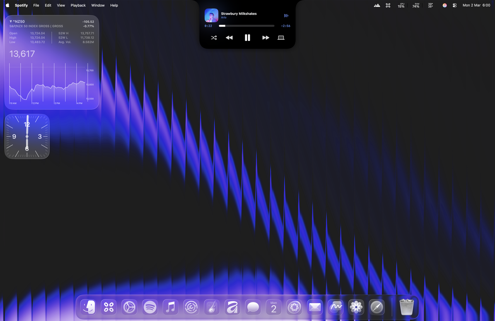
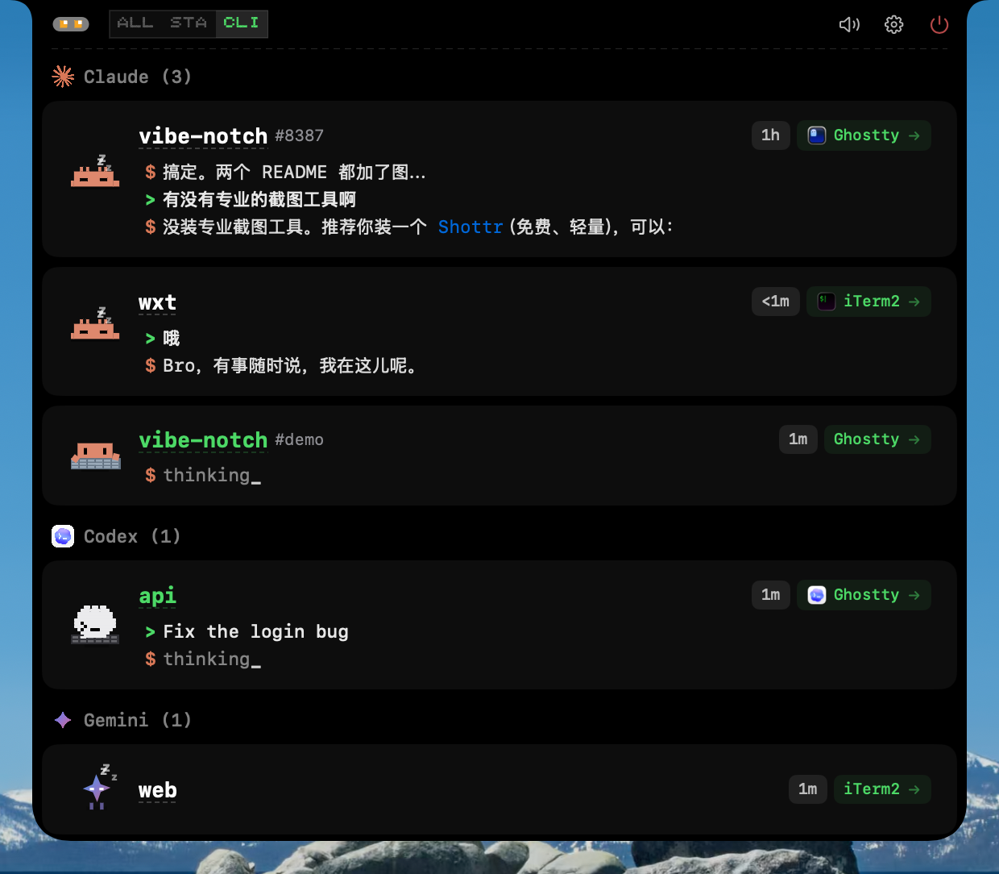

# Atoll Island

Atoll Island is an independent community fork that combines
[Atoll](https://github.com/Ebullioscopic/Atoll) with an embedded
[CodeIsland](https://github.com/wxtsky/CodeIsland) panel in one macOS app.
It is not an official release of either upstream project.

[Downloads](https://github.com/dddavid4real/Atoll-Island/releases) ·
[Source](https://github.com/dddavid4real/Atoll-Island) ·
[Issue tracker](https://github.com/dddavid4real/Atoll-Island/issues)

## Atoll + CodeIsland, in one app

<table>
  <tr>
    <th width="50%">Atoll foundation</th>
    <th width="50%">CodeIsland agent experience</th>
  </tr>
  <tr>
    <td align="center" valign="top">
      <a href="https://github.com/Ebullioscopic/Atoll">
        
      </a>
      <br>
      <sub>Media, utilities, system information, and the notch interaction model.</sub>
    </td>
    <td align="center" valign="top">
      <a href="https://github.com/wxtsky/CodeIsland">
        
      </a>
      <br>
      <sub>Live coding-agent sessions and attention states in the notch.</sub>
    </td>
  </tr>
</table>

Atoll Island keeps Atoll's existing panels and adds Code Island as another
first-class panel. When no agent session is active, it follows Atoll's sizing,
navigation, typography, and interaction patterns. Active agent work can expand
into a CodeIsland-inspired presentation and takes priority over noncritical
media or utility activity.

These are representative screenshots from the two upstream projects. Atoll
Island intentionally does **not** copy CodeIsland's approval or answer controls:
those decisions stay in Codex or the originating terminal. Image sources and
license notes are recorded in [docs/images/README.md](docs/images/README.md).

## What it does

- Keeps Atoll's media, timer, clipboard, shelf, system-stat, and utility panels.
- Adds Code Island as a persistent Atoll panel for local coding-agent sessions.
- Shows active Codex work in the notch and gives it priority over noncritical
  media and utility presentations.
- Routes approvals and answers back to Codex or its terminal. Atoll Island
  never approves a command or submits an answer itself.
- Stores only sanitized session metadata, not prompts, commands, or responses.

## Beta status and signing

Public builds are currently distributed as **unsigned beta releases**. They are
ad-hoc code-signed for bundle integrity, but they are not signed with an Apple
Developer ID and are not notarized by Apple. macOS will therefore show a
Gatekeeper warning.

Bypassing that warning does not establish that an app is safe. Review the
source and release notes, download only from this repository, and compare the
published SHA-256 checksum before opening the app.

## Requirements

- macOS 14.6 or later.
- An Apple-silicon MacBook with a display notch.
- Codex for the current Code Island monitoring integration.
- Xcode 16 or later only when building from source.

## Install the unsigned beta

1. Download the `Atoll-Island-…-UNSIGNED.dmg` file and matching `.sha256` file
   from [GitHub Releases](https://github.com/dddavid4real/Atoll-Island/releases).
2. In Terminal, verify the download from the folder containing both files:

   ```bash
   shasum -a 256 -c Atoll-Island-*-UNSIGNED.dmg.sha256
   ```

3. Open the DMG and drag **Atoll Island** into **Applications**.
4. In Applications, **Control-click** Atoll Island, choose **Open**, then confirm
   **Open** in the Gatekeeper dialog. This is Apple's standard one-app override
   for an unsigned build.
5. Grant only the macOS permissions required by the features you choose to use.

Atoll Island is a notch-only accessory app. It does not open a conventional
Dock window. Hover over or click the display notch to use it.

## Enable Code Island

1. Open the notch and select **Code Island**.
2. Review the exact Codex monitoring files Atoll Island proposes to manage.
3. Confirm activation.
4. Keep approvals, permission decisions, and question responses in Codex or the
   originating terminal.

If a Codex session is working or waiting for attention, opening the notch goes
directly to Code Island. With no active agent session, normal Atoll navigation
is preserved.

## Updates

Automatic updates are disabled in this fork until it has its own signed and
audited update channel. Install newer beta releases manually from GitHub.

## Branches

- `main` — reviewed public beta and release source.
- `dev` — ongoing integration work.
- Short-lived feature branches are merged and removed after verification.

The pre-release integration branch is retained temporarily as a review and
recovery reference. It is not the branch users should download or build.

## Build from source

```bash
git clone https://github.com/dddavid4real/Atoll-Island.git
cd Atoll-Island
git checkout main
open DynamicIsland.xcodeproj
```

Select the `DynamicIsland` scheme in Xcode and build for **My Mac**. A locally
built app is not equivalent to an Apple-notarized public release.

## License and provenance

Atoll Island is distributed under the GNU GPL v3 in accordance with Atoll's
license. Reused CodeIsland components retain their MIT license and attribution
inside the source tree and application bundle.

This project preserves upstream provenance and thanks the maintainers and
contributors of:

- [Atoll](https://github.com/Ebullioscopic/Atoll)
- [CodeIsland](https://github.com/wxtsky/CodeIsland)
- [Boring.Notch](https://github.com/TheBoredTeam/boring.notch)
- [Stats](https://github.com/exelban/stats)
- [SwiftTerm](https://github.com/migueldeicaza/SwiftTerm)
- [Sparkle](https://github.com/sparkle-project/Sparkle)

See [LICENSE](LICENSE), the upstream history, and bundled third-party notices
for the complete terms and attribution.
