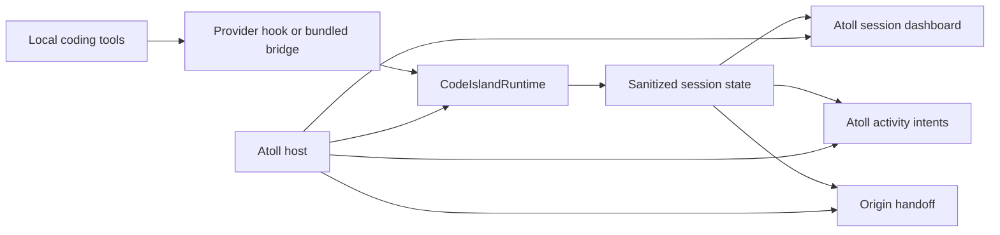

# Code Island in Atoll: Integration Design

**Status:** Frozen; Phases 1-7 implementation complete; signed/notarized artifact execution pending release CI

**Date:** 2026-08-04

**Frozen:** 2026-08-04 by user approval

**Phase 1 authorized:** 2026-08-04 by user approval

**Phase 1 completed:** 2026-08-04

**Phase 2 authorized:** 2026-08-04 by user approval

**Phase 2 completed:** 2026-08-04

**Phase 3 authorized:** 2026-08-04 by user approval

**Phase 3 completed:** 2026-08-04

**Phase 4 authorized:** 2026-08-04 by user approval

**Phase 4 completed:** 2026-08-04

**Phase 5 authorized:** 2026-08-04 by user approval

**Phase 5 completed:** 2026-08-04

**Phase 6 authorized:** 2026-08-04 by user approval

**Phase 6 completed:** 2026-08-04

**Phase 7 authorized:** 2026-08-04 by user approval

**Phase 7 implementation completed:** 2026-08-04

**Atoll baseline:** `dev` at `d4685ec18a7a6d1310e0ac081ce1a3cb4ccb7f87`

**CodeIsland baseline:** `main` at `9e3a1eb1844f0b8bf05193228a6ffa41a013dec2`

Material changes to the frozen product contract require explicit user approval and an ADR amendment or new ADR. Implementation is authorized one phase at a time; Phases 1 through 7 have been authorized and implemented. The credentialed signed/notarized artifact gates run in release CI and remain distinct from local implementation completion.

Confirmed implementation choices:

- The first provider verification cohort is Codex only.
- The Code Island tab sits immediately before Atoll's Terminal tab.
- The history-preserving source import uses `git subtree`.
- The Phase 5 Codex profile is **Monitoring** and is available only after the
  user reviews and confirms the current installation plan. The metadata-only
  bridge has a tested non-owning completion contract. Interactive questions
  remain on the excluded active-responder app-server path, and tool-failure
  observation remains gated because the documented hook payload has no stable
  success bit. Codex is therefore not promoted to Native attention.
- Phase 6 uses an urgency-ordered metadata dashboard and a pure presentation
  policy. Atoll owns queueing, duration, tab selection, notch placement, and
  origin activation. Exact-origin suppression requires a positive Terminal TTY
  or iTerm session-ID match; application-only and uncertain matches present.
- Phase 7 keeps feature preferences in Atoll's namespace, imports only an
  explicitly selected content-free legacy subset, ships four audited upstream
  sounds and the full MIT notice, and verifies that release artifacts contain
  one Atoll app, one signed bridge, and no standalone CodeIsland lifecycle.
  Its dedicated string catalog currently provides an audited English source
  and fallback; additional language translations remain future work.

## Outcome

Atoll is the only installed macOS application and the only owner of notch windowing, navigation, settings, updates, and activity priority. Code Island becomes an independently maintainable internal feature module with two Atoll-hosted presentations:

1. A persistent, Atoll-native **Code Island tab** containing a multi-session dashboard.
2. An original-CodeIsland-styled **agent live activity** and selective event pop-outs.

The originating terminal or native agent app remains the sole authority for approvals and answers. Atoll detects that attention is required and returns the user to that origin; it never submits a decision.

## Scope

Included in the first merged release:

- Local coding-tool discovery, explicit per-tool activation, hook health, and reversible removal.
- Capability-gated session monitoring and, where verified, native attention handoff.
- Concurrent-session dashboard, origin activation, mascots, sounds, compact activity, and selective pop-outs.
- Guided adoption from an existing CodeIsland installation.

Deferred:

- Remote-host and SSH session management.
- iPhone, Apple Watch, ESP32, and other Buddy integrations.
- In-Atoll approval, denial, always-allow, option selection, or free-text answers.
- Rich prompt, response, command, question, or tool-input history.

## Product state model

| Agent state | Atoll presentation | Focus behavior | Visual language |
|---|---|---|---|
| Not activated | Persistent tab with setup guidance | None | Atoll |
| No active session | Persistent tab with idle state | None | Atoll |
| Running or processing | Persistent compact agent live activity when the notch is available | Never opens the full tab | CodeIsland identity in Atoll geometry |
| Session start | Brief mascot animation | No tab switch | CodeIsland |
| Approval or question | Minimal attention handoff | Selects Code Island unless exact origin is already visible | CodeIsland alert identity with Atoll interaction patterns |
| Completion | Pop-out for about five seconds | No focus theft; exact-origin suppression applies | CodeIsland |
| Tool failure | Brief error pop-out | No focus theft; exact-origin suppression applies | CodeIsland |
| Routine tool event | State update only | None | Compact activity |

The attention handoff contains only the agent, project or session, waiting reason, and an **Open in origin** action. It contains no prompt, command, question, answer, or authorization control.

## Architecture

### Internal package boundary

Use a local Swift package inside the Atoll repository, with no nested application target:

- **CodeIslandCore** — provider-neutral event normalization, session state, safe view models, and pure tests.
- **CodeIslandRuntime** — hook server, provider adapters, discovery, activation, installer, metadata persistence, and capability registry.
- **CodeIslandUI** — sanitized session dashboard components, mascots, sounds, compact activity, and pop-out visuals.
- **codeisland-bridge** — bundled helper executable used by activated provider hooks.
- **Atoll host adapters** — lifecycle, tab registration, activity arbitration, settings, shortcuts, and window-aware origin activation in the Atoll target.

CodeIsland's executable application shell is not imported. `CodeIslandApp`, `AppDelegate`, `PanelWindowController`, `SettingsWindowController`, `StatusItemController`, and `UpdateChecker` have no role in the merged product.

The feature package must not depend on Sparkle; Atoll already owns updates. Yams may remain confined to installer code that genuinely requires YAML editing.

### Source ownership and upstream sync

Import CodeIsland into the Atoll repository as a history-preserving internal subtree or equivalent source import, not a Git submodule and not an untracked copy. Add an `UPSTREAM.md` ledger beside the package containing:

- Upstream URL and imported commit.
- Import date and license notice.
- Atoll-only patches and deliberately excluded upstream areas.
- The verification commands required after an upstream refresh.

Upstream changes land first at the module boundary and must not reintroduce a second application lifecycle, responder UI, remote/Buddy code, or rich persistence.

## Runtime and lifecycle

### Before activation

- The Code Island tab is visible.
- Tool discovery is read-only.
- No socket listener, bridge installation, hook/plugin write, repair timer, or provider configuration mutation occurs.

### Activation

1. Show detected tools, verified capability level, limitations, and every configuration path that would change.
2. Receive explicit per-tool consent.
3. Check for an existing CodeIsland process or socket listener; do not compete for the socket.
4. Start Atoll's listener before installing any selected hook, preserving upstream's safe ordering.
5. Install only selected integrations and verify the exact entries written.
6. Start repair only for those activated entries.

New providers introduced by an update remain inactive until separately confirmed.

### Deactivation and shutdown

- Enter pass-through mode before changing installed hooks.
- Remove only Atoll-managed entries, preserving unrelated provider configuration.
- Drain bounded in-flight work, then stop discovery and the listener.
- App shutdown must not turn an in-flight native prompt into an allow, deny, or skipped answer.

## Provider contract

Support is a verified capability, not a blanket provider count.

| Level | Required behavior |
|---|---|
| Monitoring | Detect session lifecycle and meaningful transitions, maintain sanitized state, and return the user to the origin. |
| Native attention | Everything in Monitoring, plus detect approval/question waiting while proving the native prompt remains visible and usable. |

For ordinary events, the bridge acknowledges promptly. For native-attention events, the adapter derives sanitized waiting state and immediately returns the provider-specific defer/pass-through response. It must never retain the current upstream behavior of waiting hours for an Atoll decision.

The current Codex app-server `requestUserInput` path is an active responder and cannot be reused unchanged. It must either negotiate a proven observation-only contract or be excluded in favor of a non-owning monitoring channel. Receiving a server request and leaving it unanswered is prohibited.

Every provider level requires fixtures for allow, deny, question, cancellation, timeout, missing Atoll, and Atoll shutdown. If native pass-through cannot be proven, the provider remains at Monitoring.

## Presentation ownership

The runtime emits state and presentation intents; it never changes Atoll views directly. Atoll decides whether an intent becomes a tab selection, compact live activity, queued pop-out, badge, sound, or no visible change.

Activity arbitration follows these rules:

1. System and privacy indicators win.
2. Blocking agent handoffs may interrupt noncritical content.
3. Processing agents use a secondary indicator where supported and otherwise yield to music, timers, recording, and similar activities.
4. Completion and failure pop-outs queue behind higher-priority activity and appear after it clears.
5. A pop-out is suppressed only after a positive match to the exact visible origin session; uncertainty presents rather than suppresses.

Atoll's existing tab enum, tab order, content switch, and closed-notch activity selection gain one built-in Code Island route. Code Island does not use AtollExtensionKit as its primary integration boundary and does not create an `NSPanel`.

## Data and privacy

The persisted session projection is limited to:

- Provider and opaque session identity.
- Project identity needed for display and navigation.
- Terminal, IDE, pane, or window handles needed for origin handoff.
- Derived state and timestamps.

Prompt text, assistant responses, commands, questions, answer options, tool input, raw payloads, and message previews are not written to session files, preferences, logs, crash context, or diagnostics. Rich hook payloads may exist transiently only long enough to derive permitted state and must not cross into UI view models.

Guided adoption ignores upstream CodeIsland's persisted prompt/response fields. Diagnostics use the same sanitized projection and require user initiation.

## Settings ownership

Atoll's searchable settings window receives one **Code Island** page under Developer or Integrations:

- Activation, detected providers, capability labels, changed paths, hook health, repair, and uninstall.
- Session grouping, retention, smart suppression, transition presentation, mascots, and feature sounds.

Code Island shortcut actions live in Atoll's existing Shortcuts page. Approval/deny/answer shortcuts are removed. Launch at login, display selection, language, application appearance, updates, and About remain solely owned by Atoll. Remote and Buddy pages are absent.

## Existing CodeIsland adoption

Read-only detection covers `com.codeisland.app` preferences, `~/.codeisland/`, provider hook/plugin entries, and `/tmp/codeisland-<uid>.sock`.

- If the old app is running, ask the user to quit it; never terminate it automatically.
- Show compatible feature preferences and integrations before import.
- Apply the same per-tool consent used by fresh activation.
- Preserve compatible hook paths when that avoids needless provider rewrites.
- Never delete `CodeIsland.app`.
- Provide recovery guidance for a remaining listener or partially migrated hook set.

## Bundle, dependencies, and licensing

- Embed `codeisland-bridge` in `Atoll Island.app/Contents/Helpers`, build it for every Atoll Island release architecture, and sign it before signing the app bundle.
- Package mascot, icon, sound, and provider-plugin resources through the internal package without retaining CodeIsland's application icon or app bundle.
- Do not add Bluetooth entitlements in the first release; Buddy is deferred.
- Reuse Atoll's Sparkle installation and update lifecycle.
- Preserve CodeIsland's MIT copyright and license in a third-party license file and update Atoll's `NOTICE`. The distributed combined application remains under Atoll's GPL-3.0 terms; this statement is an engineering requirement, not legal advice.

## Implementation sequence

1. **Provenance and package extraction** — import the baseline, add license/upstream ledgers, establish package targets, and keep all feature runtime disabled.
2. **Safety-first runtime** — introduce sanitized session state, metadata-only persistence, provider capability contracts, immediate pass-through behavior, and fixture tests.
3. **Atoll host shell** — add the persistent tab, idle/setup dashboard, host lifecycle, settings route, and activity-intent adapter without installing hooks.
4. **Activation and adoption** — add read-only discovery, explicit per-tool consent, listener-before-installer ordering, reversible removal, and socket-conflict migration.
5. **Verified provider rollout** — enable Monitoring and Native attention provider by provider; never promote a capability without its pass-through tests.
6. **Presentation rollout** — add the multi-session dashboard, compact agent live activity, selective pop-outs, cooperative arbitration, and exact-origin suppression.
7. **Release hardening** — regression, accessibility, localization, resource, helper-signing, notarization, upgrade, and rollback verification.

Each phase must leave Atoll buildable and Code Island disabled or safely usable; no phase may depend on shipping an unverified blocking hook.

## Release gates

- One `Atoll Island.app`; no CodeIsland application, settings window, updater, status item, or notch panel process.
- Zero provider-configuration writes before explicit consent.
- Native approvals and questions remain visible and answerable in the originating tool.
- Atoll never emits allow, deny, always-allow, answer, or skip decisions.
- No prompt, response, command, question, answer, or raw payload is persisted or exported.
- Exact-origin suppression has positive-match and false-match tests.
- Activity priority and queued pop-outs are deterministic under concurrent media, timer, recording, system, and agent events.
- Guided adoption cannot produce two socket listeners and does not delete the old app.
- The helper and resources pass release signing and notarization checks.
- Existing Atoll features and tests remain green; provider capability tests and UI state tests are green.
- CodeIsland attribution and the upstream ledger are present in the release source and bundle notices.

## Decision index

- [ADR 0001 — Integrate Code Island into Atoll as one application](adr/0001-integrate-code-island-into-atoll.md)
- [ADR 0002 — Maintain Code Island as an internal module](adr/0002-maintain-code-island-as-an-internal-module.md)
- [ADR 0003 — Ship the local agent workflow first](adr/0003-ship-the-local-agent-workflow-first.md)
- [ADR 0004 — Keep agent decisions at the origin](adr/0004-keep-agent-decisions-at-the-origin.md)
- [ADR 0005 — Use an Atoll tab and an agent live activity](adr/0005-use-an-atoll-tab-and-an-agent-live-activity.md)
- [ADR 0006 — Require explicit Code Island activation](adr/0006-require-explicit-code-island-activation.md)
- [ADR 0007 — Consolidate Code Island settings into Atoll](adr/0007-consolidate-code-island-settings-into-atoll.md)
- [ADR 0008 — Guide adoption from CodeIsland](adr/0008-guide-adoption-from-codeisland.md)
- [ADR 0009 — Gate provider capabilities](adr/0009-gate-provider-capabilities.md)
- [ADR 0010 — Persist session metadata only](adr/0010-persist-session-metadata-only.md)
